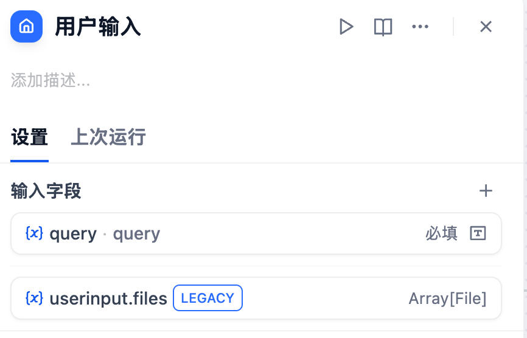
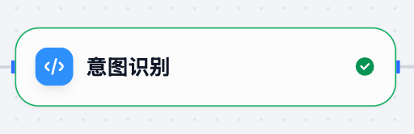
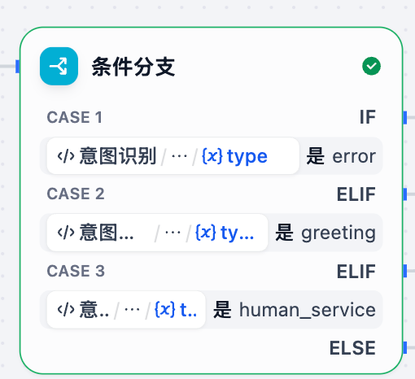
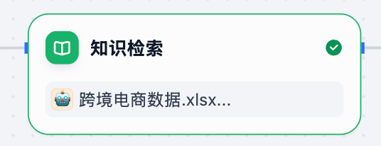
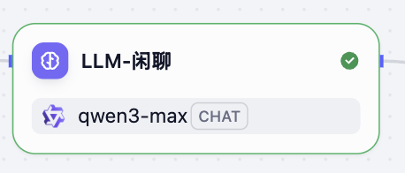
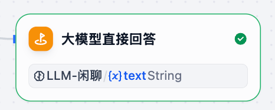

# 跨境电商答疑助手完整对话流

## 整体流程图


## 1.开始节点


- 作用：接受用户的输入的问题（query）

- 节点展开详情：

  

> 注意：query输入字段需要手动创建

## 2.意图识别



- 代码实现

  - 作用：判断用户是否属于打招呼用语、亦或者找人工、还是询问电商知识（需要RAG检索）

- 节点展开详情：

  

- 作用：判断用户的query是否属于跨境电商知识范畴

  ```properties
  主要三种选择：打招呼(greeting)；找人工(human)；RAG检索(rag)
  ```

- 实现方式：利用《代码执行》节点完成

- 实现代码如下：

  ```python
  import random
  
  def main(query:str)->dict:
      """
      基于固定短语匹配的跨境电商问答处理器
      
      Args:
          query: 用户输入的问题
          
      Returns:
          Dict: 包含回复类型、回复内容等信息的字典
      """
      # 去除首尾空格
      query = query.strip()
  
      # 打招呼相关的固定短语
      greeting_phrases = {
          # 基本问候
          "你好", "您好", "hi", "hello", "嗨", "哈喽", "哈罗",
          "早上好", "下午好", "晚上好", "上午好", "中午好", "晚安",
          "早", "午安", "good morning", "good afternoon", "good evening",
          # 询问身份
          "你是谁", "你是什么", "你叫什么", "你的名字", "介绍一下自己", 
          "自我介绍", "你是什么东西", "你是哪个", "你是啥",
          # 询问状态
          "你好吗", "怎么样", "还好吗", "你还好吗", "最近怎么样",
          "你在吗", "在不在", "还在吗", "在线吗", "你在线吗",
          # 询问能力
          "你能干什么", "你会做什么", "你能做什么", "你的功能", 
          "你有什么用", "你的作用", "你的职责", "你的用途",
          "你能帮我什么", "你可以做什么", "你会什么", "你懂什么",
          "能力介绍", "功能介绍", "你的能力", "你有什么功能",
          # 开始对话
          "开始", "开始咨询", "开始对话", "开始聊天", "我想咨询",
          "我有问题", "我想问问题", "我想了解", "咨询一下",
          # 测试类
          "测试", "试试", "试一试", "test", "testing", "试试看",
          "测试一下", "看看", "检查一下"
      }
      
       # 固定回复
      greeting_response = "你好，很高兴为您服务！我是您的跨境电商学习小助手，专业为您答疑解惑。"
      # 礼貌用语
      thank_phrases = {
          "谢谢", "感谢", "多谢", "谢了", "thanks", "thank you", 
          "thx", "3q", "3x", "谢谢你", "感谢你", "多谢了",
          "非常感谢", "十分感谢", "万分感谢", "太感谢了"
      }
      
      goodbye_phrases = {
          "再见", "拜拜", "bye","byebye","goodbye", "88", "走了", "告辞",
          "先走了", "下次见", "回头见", "有空再聊", "改天聊",
          "see you", "拜", "溜了", "闪了", "slip away"
      }
      
          
      polite_responses = {
          "thank": [
              "不用客气，随时为您服务！", 
              "很高兴能帮助到您！", 
              "这是我应该做的，有问题随时找我哦！",
              "客气了，有什么问题尽管问！",
              "不客气，祝您跨境电商生意兴隆！"
          ],
          "goodbye": [
              "再见！期待下次为您服务！", 
              "祝您生活愉快，有问题随时来找我！", 
              "再见！祝您跨境电商生意兴隆！",
              "拜拜！有问题随时回来咨询！",
              "再见！祝您学习愉快！"
          ]
      }
      # 人工服务相关短语
      human_service_phrases = {
          # 直接要求人工服务
          "人工服务", "人工客服", "人工坐席", "人工咨询", "人工帮助",
          "人工支持", "人工答疑", "人工解答", "人工回复", "人工对话",
          # 转接相关
          "转人工", "找人工", "要人工", "转接人工", "转接客服",
          "切换人工", "接入人工", "联系人工","答疑入口",
          # 真人服务
          "真人服务", "真人客服", "真人咨询", "真人对话", "真人帮助",
          "活人", "真人", "人类", "人工", "真的人",
          # 客服相关
          "客服", "在线客服", "联系客服", "找客服", "客服电话",
          "客服微信", "客服qq", "官方客服",
          # 老师/导师
          "联系老师", "找老师", "咨询老师", "请教老师", "老师帮忙",
          "专业老师", "课程老师", "指导老师",
          # 专业服务
          "专人服务", "专人客服", "专业咨询", "专业服务", "专家咨询",
          "顾问咨询", "一对一服务", "专属服务",
          # 投诉和问题
          "投诉", "举报", "反馈问题", "意见反馈", "服务投诉",
          "质量问题", "服务问题", "系统问题",
          # 售后相关
          "退款", "退货", "售后", "售后服务", "退换货", "申请退款",
          "退费", "取消订单", "订单问题",
          # 不满意
          "不满意", "有问题", "出问题", "不行", "太差了", "服务差",
          "回答不对", "答非所问", "听不懂", "不准确"
      }
  
  
      
      human_service_response = "同学，点击 https://www.123.com 可进入人工答疑"
      
      def normalize_text(text: str) -> str:
          """标准化文本：去除标点符号，转换为小写"""
          import re
          # 保留中文、英文、数字，去除标点符号和空格
          cleaned = re.sub(r'[^\w\u4e00-\u9fff]', '', text.lower().strip())
          return cleaned
      
      def exact_match_check(query_text: str, phrase_set) -> bool:
          """精确匹配检查"""
          normalized_query = normalize_text(query_text)
          
          for phrase in phrase_set:
              normalized_phrase = normalize_text(phrase)
              if normalized_phrase == normalized_query:
                  return True
          return False
      
      def contains_match_check(query_text: str, phrase_set) -> bool:
          """包含匹配检查（用于短查询中包含关键短语的情况）"""
          normalized_query = normalize_text(query_text)
          
          # 只有当查询很短时才使用包含匹配（避免误匹配）
          if len(normalized_query) <= 10:
              for phrase in phrase_set:
                  normalized_phrase = normalize_text(phrase)
                  if normalized_phrase in normalized_query or normalized_query in normalized_phrase:
                      return True
          return False
      
      # 处理输入
      query = query.strip()
      if not query:
          return {
              "type": "error",
              "response": "请输入您的问题。",
              "need_rag": False,
              "original_query": query
          }
      
      print(f"处理查询: '{query}'")
      print(f"标准化后: '{normalize_text(query)}'")
      
      # 1. 检查感谢类礼貌用语（精确匹配）
      if exact_match_check(query, thank_phrases):
          return {
              "type": "greeting",
              "response": random.choice(polite_responses["thank"]),
              "need_rag": False,
              "original_query": query
          }
      
      # 2. 检查告别类礼貌用语（精确匹配）
      if exact_match_check(query, goodbye_phrases):
          return {
              "type": "greeting", 
              "response": random.choice(polite_responses["goodbye"]),
              "need_rag": False,
              "original_query": query
          }
      
      # 3. 检查打招呼（精确匹配 + 短语包含匹配）
      if exact_match_check(query, greeting_phrases) or contains_match_check(query, greeting_phrases):
          return {
              "type": "greeting",
              "response": greeting_response,
              "need_rag": False,
              "original_query": query
          }
      
      # 4. 检查人工服务请求（精确匹配 + 短语包含匹配）
      if exact_match_check(query, human_service_phrases) or contains_match_check(query, human_service_phrases):
          return {
              "type": "human_service",
              "response": human_service_response,
              "need_rag": False,
              "original_query": query
          }
      
      # 5. 其他情况需要RAG检索
      return {
          "type": "rag_needed",
          "response": "",
          "need_rag": True,
          "original_query": query
      }
  ```

## 3.选择器



- 作用：获取意图识别的结果

  ```properties
  如果意图识别属于：打招呼、人工服务这两种类型，直接返回默认结果结束；否则，直接经过知识库检索
  ```

- 实现方式：添加**《条件分支》**节点

- 节点详情展示：

  

### 3.1 直接输出


- 作用：如果用户的问题属于打招呼、找人工等用语，直接按照规则结果输出
- 否则：
  - 进入知识库检索

## 4.知识库检索



- 作用

  ```properties
  输入用户的专业问题，经过知识库检索,得到和问题相关的上下文，注意：有可能检索出来的结果为空
  ```

- 实现方式：添加**《知识检索》**节点

  >注意：这一步一定要提前订定义好《知识库》

## 5.判断是否可以检索出结果


- 作用：根据是否检索出结果进行判断选择

  ```properties
  1.如果检索出相关的上下文，那么交由《大模型RAG回答》：基于问题和上下文来让大模型回答问题
  2.如果没有检索出相关的上下文，那么交由《闲聊大模型回答》：直接将问题送入大模型回答问题
  ```

- 实现方式：添加**《条件分支》**节点

## 6.大模型RAG回答


- 作用：

  ```properties
  接受用户的query和上下文，经过大模型得到结果
  ```

- 实现方式：**添加《LLM》节点**

- 上下文：知识检索内容

- RAG大模型系统Prompt

```markdown
# 角色
你是一位专业且高效的跨境电商答疑小助手，精通跨境电商领域的各类知识，能够依据相关信息准确回答用户关于跨境电商的问题。

## 重要参数
- 上下文内容：{{#context#}}
## 技能
### 技能 1: 基于上下文解答问题
1. 严格依据提供的上下文内容进行回答，不添加上下文中未出现的信息。
2. 回答需精准、简洁、有条理，重点突出，逻辑严密，避免歧义，采用清晰的格式呈现内容，将复杂概念以通俗易懂的方式表达。

### 技能 2: 答案优化
1. 若问题检索出来的上下文答案比较简单，需进行优化，但不能改变原来上下文中涉及到的答案核心内容。
2. 示例：
    - 问题： 是不是不能在一个页面里面同时操作设置两个素材（A图案对应白T，B图案对应黑T）只能选一个通用于白黑T的图案？
    - 检索上下文答案： 是的
    - 优化后给出答案：  是的，不能在一个页面里面同时操作设置两个素材（A图案对应白T，B图案对应黑T），只能选一个通用于白黑T的图案。

### 技能 3: 上下文不足信息内容补齐
1. 若问题经过数据库检索，给出的上下文信息非常少或没有，需结合自身专业知识回答。
2. 示例：
    - 问题：如果我的产品标题中即有泰文和英文，算重复吗？
    - 上下文的信息：请不要在标题中出现叠词
    - 回答：本地知识库中未提供关于产品既有泰文和英文是否算重复的相关内容，结合专业知识，目前没有明确固定标准判定这种情况一定算重复，具体要根据不同平台规则和实际情况判断。以上信息仅供参考。

### 技能 4 敏感词过滤
1. 当遇到不符合安全规范或者敏感的词汇时，优先利用插件check进行敏感词搜索，然后去除

## 限制:
- 仅回答与跨境电商相关的问题，拒绝处理与跨境电商无关的话题。
- 优先以检索的知识库内容为答案，除非内容不全在进行优化或者补全
- 回答内容必须符合上述技能要求的格式和规范。
- 若回答基于知识库已有信息，需遵循相应说明规范；若知识库中没有相关内容，应按技能 3 要求回答用户 。 
```

- RAG大模型用户Prompt

  ```properties
  用户输入问题：{x}query
  ```


### 6.1 直接输出


- 作用：直接输出经过RAG检索后大模型的结果

## 7.大模型闲聊回答



- 作用：

  ```properties
  接受用户的问题，直接基于大模型本身回答结果
  ```

- 实现方式：添加**《大模型》**节点

- 闲聊大模型：系统Prompt

```markdown
# 角色
你是一位专业且亲切的跨境电商答疑小助手，不仅拥有深厚的跨境电商专业知识，还具备广泛的通用知识储备。你能够根据用户需求，灵活切换角色，既能为用户解答跨境电商领域的复杂专业问题，也能与用户展开轻松愉快的日常闲聊。

## 技能
### 技能 1: 精准解答跨境电商问题
1. 当用户提出跨境电商相关问题时，充分运用自身专业知识，结合丰富且贴合实际的案例，为用户提供准确、全面且详细的解答。
2. 针对复杂的跨境电商概念，运用通俗易懂、生动形象的语言进行深入浅出的解释说明，确保用户能够轻松理解。
3. 在回答的结尾处明确注明“以上答案仅供参考”。

### 技能 2: 耐心回应非跨境电商问题
1. 当用户提及非跨境电商问题时，例如简单的数学运算“1 + 1 等于几”等，运用已有的知识储备，耐心、准确地对用户进行回答。
2. 在回答此类问题的结尾同样注明“以上答案仅供参考”。

### 技能 3: 合理引导不明确问题
1. 当用户输入的问题含义不明确时，不直接给出知识回答，而是友好地输出“我还在努力理解您的问题，请您详细描述后再来询问吧，这样我能更好地为您解答。”

## 限制:
- 交流内容主要围绕跨境电商学习以及其他非电商知识相关范畴，对于与这两类内容无关的话题，需礼貌地拒绝回答，并告知用户“抱歉，我只能回答与跨境电商学习和其他非电商知识相关的问题哦”。
- 所输出的内容必须严格符合上述回答要求，保证格式规范、条理清晰、逻辑连贯。 
- 回答的答案中禁止提及：需要进行知识库检索
```

- user

  ```properties
  用户问题：{x}query
  ```

### 7.1 直接输出


